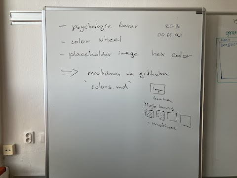

# Hodina 8.10. 2023

Na hodině webových aplikací jsme se ponořili do fascinujícího světa barev a učili jsme se o **'color wheel'** neboli barevném kruhu. Profesor nám vysvětlil, jak důležité je porozumět teorii barev při návrhu webových stránek a aplikací, protože barvy mají významný vliv na uživatelskou interakci a vnímání designu. Diskutovali jsme o základních barvách, primárních, sekundárních a terciárních barvách, a také o jejich vzájemných vztazích v barevném kruhu. Ukazovali jsme si také placeholder image, který nám pomůže vyzualizovat barvy. Celý projekt o barvách jsme nahráli na github.